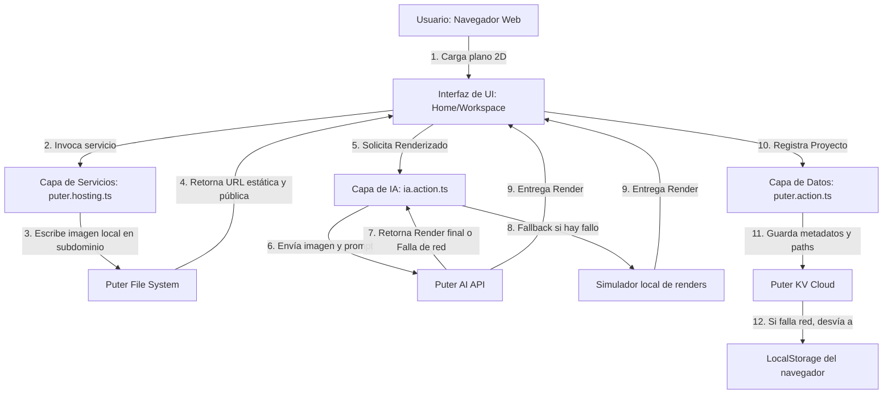

# MANUAL DE ARQUITECTURA TÉCNICA Y DOCUMENTACIÓN DE CLASES - ROOMIFI

Este documento constituye una guía detallada y exhaustiva de la estructura de código, clases, módulos, utilidades y decisiones de diseño técnico que componen **Roomifi**. Su propósito es servir como material de referencia técnica para mantenimiento, auditoría de software y ampliación futura del sistema.

---

## 1. VISTA GENERAL DE LA ARQUITECTURA Y FLUJO SERVERLESS

Roomifi adopta una arquitectura de frontend desacoplada alimentada por un backend serverless provisto por **Puter.js**. A diferencia de los desarrollos Web tradicionales, Roomifi elimina la necesidad de configurar servidores de backend y bases de datos intermediarias mediante el uso de la infraestructura del sandbox de cada usuario.

### El flujo de datos y control del sistema
El siguiente diagrama detalla cómo interactúan las distintas capas del software ante las acciones del usuario:



### Capa Frontend vs. Capa Backend Serverless
1.  **Frontend (React Router v7 + Vite)**: Procesa los estados reactivos en local, gestiona los eventos del mouse y gestos táctiles (para el visor interactivo de comparación) y renderiza las vistas y componentes.
2.  **Capa Serverless (Puter SDK)**: Resuelve la autenticación, aloja archivos mediante hosting web estático en subdominios virtuales creados bajo demanda y procesa prompts de IA mediante red neuronal remota.
3.  **Capa de Resiliencia**: Un puente de contingencia híbrido que conmuta a base de datos local (`localStorage`) y lectura en memoria de archivos (`FileReader` en Base64) en caso de fallos de red por firewalls o adblockers.

---

## 2. DOCUMENTACIÓN DETALLADA DE COMPONENTES Y RUTAS (.tsx)

### A. Proveedor de Autenticación: `app/context/AuthContext.tsx`
Este módulo es el núcleo de la seguridad y sesión del software. Define un contexto global de React que distribuye las credenciales e inicialización del SDK de Puter.js.

#### Interfaces y Tipos
*   `User`: Representa al usuario autenticado en Puter.
    ```typescript
    interface User {
      username: string;
      // Propiedades adicionales devuelvas por Puter API
    }
    ```
*   `AuthContextType`: Contrato de métodos y propiedades que expone el contexto.
    ```typescript
    interface AuthContextType {
      user: User | null;
      isLoading: boolean;
      signIn: () => void;
      signOut: () => void;
    }
    ```

#### Propiedades del Estado Interno (Hooks)
1.  `user` (`User | null`): Almacena los metadatos del usuario logueado en la sesión activa. Por defecto es `null`.
2.  `isLoading` (`boolean`): Bandera lógica que bloquea la renderización del Workspace mientras se determina el estado de sesión o se descarga la API de Puter. Inicializa en `true`.

#### Métodos y Lógica Paso a Paso
*   **`useEffect` (Inicialización)**:
    1.  Crea un intervalo repetitivo (`setInterval`) cada 100 milisegundos.
    2.  Verifica si la variable global `window.puter` ha sido inyectada por el script CDN en el navegador.
    3.  Al confirmarse la presencia de `window.puter`, cancela el intervalo (`clearInterval`).
    4.  Llama al método asíncrono de verificación de sesión `checkAuth()`.
*   **`checkAuth()` (Asíncrono, Privado)**:
    *   Verifica si el cliente web está autenticado en la plataforma mediante: `window.puter.auth.isSignedIn()`.
    *   Si es verdadero, descarga el perfil llamando a: `window.puter.auth.getUser()`, actualizando el estado `user` con el objeto resultante.
    *   Establece la bandera `isLoading` a `false`.
*   **`signIn()` (Público)**:
    *   Dispara el popup nativo de inicio de sesión de Puter: `window.puter.auth.signIn()`.
    *   Una vez que la promesa se resuelve con éxito, invoca nuevamente a `checkAuth()` para leer la sesión cargada.
*   **`signOut()` (Público)**:
    *   Elimina la cookie de sesión del navegador del cliente invocando: `window.puter.auth.signOut()`.
    *   Limpia el estado `user` reestableciéndolo a `null` y fuerza la redirección virtual a la Landing Page.

---

### B. Plantilla Raíz de la Aplicación: `app/root.tsx`
Configura los metadatos HTML iniciales del documento, carga tipografías e inyecta la librería externa de Puter en la cabecera.

#### Métodos y Componentes Exportados
*   `links()`: Declara los endpoints de pre-conexión de tipografías de Google Fonts e inyecta la hoja de estilos de la fuente premium **Inter** con grosores del 100 al 900.
*   `Layout({ children })`: Envoltorio HTML5 principal. Inyecta la etiqueta:
    ```html
    <script src="https://js.puter.com/v2/"></script>
    ```
    en el `<head>`. Esto asegura que toda la aplicación tenga acceso a `window.puter` antes de arrancar React.
*   `App()`: Renderiza el componente raíz de la aplicación.
    *   Envuelve el árbol en `<AuthProvider>`.
    *   Establece el contenedor estructural con fondo gris concreto `#e2e8f0` para evitar destellos blancos puros.
    *   Renderiza el componente `<Navbar />` de manera fija y un contenedor `<main>` flexible que monta las rutas usando `<Outlet />`.
*   `ErrorBoundary({ error })`: Captura excepciones no controladas en las rutas de Roomifi, distinguiendo entre respuestas HTTP 404 (no encontrado) y errores de código en tiempo de ejecución, mostrando la pila de llamadas (`error.stack`) únicamente en entornos de desarrollo (`import.meta.env.DEV`).

---

### C. Barra de Navegación Premium: `components/Navbar.tsx`
Renderiza la cabecera responsiva de Roomifi, administrando las vistas de enlaces y la apertura del menú móvil e inicio de sesión.

#### Propiedades del Estado Interno
1.  `isMobileMenuOpen` (`boolean`): Controla la visualización del panel colapsable en dispositivos táctiles. Por defecto `false`.
2.  `isProfileDropdownOpen` (`boolean`): Controla la apertura del modal contextual del perfil de usuario (cerrar sesión). Por defecto `false`.
3.  `dropdownRef` (`useRef<HTMLDivElement>`): Referencia al contenedor del dropdown para detectar interacciones externas.

#### Métodos y Flujo de Control
*   **`useEffect` (Click Outside)**:
    *   Escucha eventos `mousedown` en el documento global.
    *   Si se detecta un click fuera de la caja referenciada por `dropdownRef`, establece `isProfileDropdownOpen` a `false`. Esto previene que el menú flote indefinidamente si el usuario decide hacer clic en otra sección.
*   **`handleSignOut()`**:
    *   Invoca el método `signOut` del contexto y cierra el panel colapsable del perfil.
*   **`navLinks` (Estructura)**:
    *   Contiene la lista limpia de navegación. Tras las refactorizaciones de limpieza, solo contiene el enlace de inicio:
        ```typescript
        const navLinks = [{ name: "Inicio", path: "/" }];
        ```

#### Detalle de Estilos de Diseño e Interfaz
*   **Estilo del Contenedor**: Sticky header fijo (`sticky top-0 z-50`) con fondo translúcido gris concreto, efecto glassmorphic y borde inferior difuso:
    ```tailwindcss
    w-full border-b border-slate-200/80 bg-[#e2e8f0]/75 backdrop-blur-md
    ```
*   **Logo en 3D**: Renderizado mediante SVG vectorial dinámico que utiliza un gradiente lineal ID `logo-grad` (`from-cyan-500 via-sky-400 to-amber-500`). Posee un resplandor de hover que se activa con animación `scale-105`.
*   **Indicador de Enlace Activo**: Implementa una barra inferior animada bajo el enlace activo mediante Tailwind y sombras cian de dispersión:
    ```tailwindcss
    absolute bottom-0 left-0 h-[2px] w-full rounded-full bg-cyan-500 shadow-[0_0_8px_rgba(6,182,212,0.4)]
    ```

---

### D. Botón Premium Reutilizable: `components/ui/button.tsx`
Botón modular de alta fidelidad visual con soporte para estados de carga e interactividad adaptativa.

#### Propiedades del Componente (Props)
```typescript
interface ButtonProps extends React.ButtonHTMLAttributes<HTMLButtonElement> {
  variant?: "primary" | "secondary" | "outline" | "ghost";
  size?: "sm" | "md" | "lg";
  isLoading?: boolean;
}
```

#### Variaciones de Estilo (Diccionarios de Clases)
*   `baseStyles`: Transiciones fluidas de transformación, tipografía media y feedback de pulsación:
    ```tailwindcss
    inline-flex items-center justify-center font-medium rounded-xl transition-all duration-300 ease-out active:scale-95 disabled:opacity-50 disabled:pointer-events-none
    ```
*   `variants.primary`: Gradiente continuo en tres colores con sombras en cian:
    ```tailwindcss
    bg-gradient-to-r from-cyan-500 via-sky-400 to-amber-500 text-white shadow-md shadow-cyan-500/10 hover:shadow-cyan-500/30 hover:brightness-105 font-bold
    ```
*   `variants.secondary`: Gris slate con borde mate:
    ```tailwindcss
    bg-slate-100 hover:bg-slate-200 border border-slate-200/80 text-slate-700
    ```
*   `variants.outline`: Borde cian que transiciona a fondo celeste suave en hover.
*   `variants.ghost`: Texto cian con fondo grisáceo en hover.

#### Comportamiento Técnico
El botón deshabilita su interactividad (`disabled={disabled || isLoading}`) de manera reactiva ante solicitudes asíncronas para evitar dobles peticiones paralelas a las APIs neuronales de Puter.js.

---

### E. Ruta Principal y Workspace: `app/routes/home.tsx`
Es la clase de mayor tamaño y complejidad en Roomifi, operando como controlador de vistas y orquestador del Workspace.

#### Subcomponentes Internos
1.  `LandingPage`: Se muestra a usuarios no autenticados. Contiene un grid de características y un botón de inicio que llama a la autenticación de Puter.
2.  `Workspace`: Panel de control completo que se desbloquea tras el login.

---

## 3. DOCUMENTACIÓN DE FLUJOS CLAVE EN EL WORKSPACE (home.tsx)

### A. Gestión del Historial de Proyectos (Persistencia)
El historial de proyectos del usuario se recupera y almacena a través de una arquitectura con tolerancia a fallos.

#### Propiedades del Estado
*   `projects` (`any[]`): Lista de proyectos recuperados. Cada proyecto cumple con la estructura:
    ```typescript
    interface Project {
      id: string;
      styleName: string;
      roomName: string;
      prompt: string;
      originalImage: string; // URL pública o Base64
      renderImage: string;   // URL pública o Base64
      date: string;
    }
    ```

#### Algoritmo de Carga (`useEffect`):
1.  Al montar el Workspace, se ejecuta la función `loadProjects()`.
2.  Llama al helper `getProjects(user.username)` para consultar el KV Store de Puter Cloud.
3.  Si la llamada se resuelve con éxito, establece el estado `projects` con los resultados.
4.  Si la llamada arroja error (ej: fallo de conexión de red por WebSocket bloqueado), captura la excepción mediante `catch`, consulta el almacén local del navegador: `localStorage.getItem("roomifi_projects")`, analiza el JSON y lo carga en el estado.

---

### B. Zona de Arrastre e Input de Archivos (Drag & Drop)
Administra la lectura física y subida al cloud de los planos 2D del usuario.

#### Flujo y Métodos de Captura:
*   `handleFileChange(e)`: Se dispara cuando el usuario selecciona un archivo usando el diálogo tradicional del explorador de archivos.
*   `handleDrop(e)`: Se dispara cuando el usuario arrastra y suelta un archivo directamente sobre la zona interactiva.
    *   Previene el comportamiento nativo del navegador de abrir la imagen en una pestaña nueva mediante `e.preventDefault()`.
    *   Comprueba que el archivo arrastrado sea de tipo imagen: `file.type.startsWith("image/")`.
    *   Si es válido, invoca al método de procesamiento de subida `handleUpload(file)`.

#### Lógica de Carga y Resiliencia en Memoria:
```typescript
const handleUpload = async (file: File) => {
  setIsUploading(true);
  setErrorMsg(null);
  if (window.puter && window.puter.auth.isSignedIn() && user) {
    try {
      // Subida física al Hosting de Puter
      const publicUrl = await uploadToPuterHosting(file, user.username);
      setFilePreview(publicUrl);
      setRenderResult(null);
    } catch (e) {
      console.warn("Fallo en hosting en la nube, usando previsualización local.");
      fallbackLocalPreview(file);
    } finally {
      setIsUploading(false);
    }
  } else {
    fallbackLocalPreview(file);
  }
};
```
La función `fallbackLocalPreview(file)` lee el archivo usando `FileReader` del navegador y extrae una codificación en Base64 (`reader.readAsDataURL(file)`), cargándola directamente en el estado local `filePreview` para garantizar el funcionamiento sin conexión a internet.

---

### C. Visor de Comparación interactivo (Before/After)
Para lograr una experiencia de alta fidelidad, integramos la librería `react-compare-slider` en sustitución del visor manual por `clip-path` y control del mouse nativo, lo que eliminó los fallos de stacking context y z-index en navegadores basados en WebKit/Blink (Chrome/Safari).

#### Código del Renderizador:
```tsx
<ReactCompareSlider
  className="w-full h-full"
  handle={
    <div className="flex flex-col items-center justify-center h-full relative">
      {/* Línea divisoria cian */}
      <div className="absolute top-0 bottom-0 w-0.5 bg-cyan-500 shadow-[0_0_8px_rgba(6,182,212,0.4)] z-20 pointer-events-none" />
      {/* Pomo de arrastre */}
      <div className="relative z-20 flex h-9 w-9 items-center justify-center rounded-full bg-white border-2 border-cyan-500 text-cyan-600 shadow-md cursor-ew-resize">
        <svg className="h-4 w-4" fill="none" viewBox="0 0 24 24" stroke="currentColor">
          <path strokeLinecap="round" strokeLinejoin="round" strokeWidth="2.5" d="M8 9l-4 4 4 4m8 0l4-4-4-4" />
        </svg>
      </div>
    </div>
  }
  itemOne={
    <ReactCompareSliderImage
      src={filePreview}
      alt="Plano Original 2D"
      style={{ objectFit: "contain", width: "100%", height: "100%" }}
    />
  }
  itemTwo={
    <ReactCompareSliderImage
      src={renderResult}
      alt="Render Generado"
      style={{
        objectFit: "contain",
        width: "100%",
        height: "100%",
        filter: roomType === "entire_floor_plan" && STYLE_FILTERS[designStyle] 
          ? STYLE_FILTERS[designStyle] 
          : undefined,
      }}
    />
  }
/>
```

#### Lógica de los Filtros de Simulación:
Cuando el usuario selecciona "Apartamento Completo", la aplicación carga una imagen de plano 2D renderizada en escala real. Dependiendo del estilo arquitectónico elegido por el usuario, aplicamos filtros de CSS nativos en tiempo real (`filter` prop de React) para simular acabados:
*   **Moderno**: Sin filtro (`""`).
*   **Minimalista**: Desatura los colores y aumenta el brillo para un aspecto nórdico: `saturate(0.4) brightness(1.05) contrast(0.95)`.
*   **Escandinavo**: Añade un tono sepia y reduce la saturación: `sepia(0.15) saturate(0.85) brightness(1.05)`.
*   **Industrial**: Eleva el contraste y reduce el brillo para un efecto de cemento y metales: `contrast(1.15) brightness(0.85) saturate(0.9) hue-rotate(-15deg)`.
*   **Bohemio**: Eleva la saturación de los colores tierra y añade calidez: `saturate(1.25) sepia(0.2) hue-rotate(10deg)`.

---

## 4. CAPA DE SERVICIOS Y UTILIDADES (.ts)

### A. Generador Neuronal de IA: `app/utils/ia.action.ts`
Establece la conexión de llamada asíncrona hacia el servicio de generación de imágenes de Puter.

#### Métodos y Lógica
*   **`fetchAsDataURL(url)` (Privada, Asíncrona)**:
    *   Convierte una imagen (URL remota) en su representación binaria Base64 de forma local.
    *   Realiza un `fetch` a la URL y extrae el archivo como un objeto binario `Blob`.
    *   Crea una instancia de `FileReader` y envuelve la lectura en una promesa de JavaScript.
    *   Retorna el string Base64 resultante de la conversión.
*   **`generateDesign(imageUrl, style, roomType, additionalPrompt)` (Exportada, Asíncrona)**:
    1.  Determina si la imagen de entrada está alojada en internet o es Base64. Si es una URL del FileSystem de Puter, la usa directamente; si es Base64, realiza la descarga en memoria para evitar fallos de lectura del SDK.
    2.  Estructura el prompt arquitectónico combinando las variables del usuario:
        ```typescript
        const prompt = `Architectural render of a ${roomType}, ${style} style. ${additionalPrompt}. Highly detailed, photorealistic, 8k resolution, interior design concept, architectural portfolio style.`;
        ```
    3.  Llama al modelo generador de imágenes de Puter:
        ```typescript
        const imageFile = await window.puter.ai.txt2img(prompt);
        ```
    4.  Puter procesa y devuelve un objeto de archivo virtual. Roomifi solicita su URL de lectura pública:
        ```typescript
        const publicUrl = await window.puter.fs.getReadURL(imageFile.path || imageFile);
        return publicUrl;
        ```

---

### B. Inicializador de Hosting Virtual: `app/utils/puter.hosting.ts`
Permite alojar imágenes permanentemente de forma pública sin disponer de servidores propios, asociando un subdominio web único a cada usuario.

#### Métodos y Lógica
*   **`getOrInitializeSubdomain(username)` (Asíncrona, Privada)**:
    1.  Consulta la base de datos distribuida mediante `puter.kv.get('roomifi_subdomain_' + username)`.
    2.  Si ya existe un subdominio registrado, lo retorna inmediatamente.
    3.  Si no existe:
        *   Genera una cadena de texto aleatoria (ej: `roomifi-user-12ab3`).
        *   Crea un directorio físico llamado `roomifi_site` en el almacenamiento del usuario usando `puter.fs.mkdir()`.
        *   Crea un archivo `index.html` estático básico para que el servidor de hosting no arroje errores de ruta de entrada.
        *   Registra y publica el hosting en la red de Puter:
            ```typescript
            await window.puter.hosting.create(subdomain, 'roomifi_site');
            ```
        *   Persiste el subdominio en Puter KV Cloud para futuras sesiones.
        *   Retorna el subdominio configurado.
*   **`uploadToPuterHosting(file, username)` (Asíncrona, Exportada)**:
    1.  Recupera el subdominio asociado llamando a `getOrInitializeSubdomain(username)`.
    2.  Genera un nombre de archivo único utilizando marcas de tiempo: `blueprint_[timestamp].[extension]`.
    3.  Escribe físicamente el archivo binario en el subdirectorio de Puter Cloud: `roomifi_site/[filename]` usando `puter.fs.write()`.
    4.  Retorna la URL pública directa accesible desde cualquier navegador web en el mundo:
        ```typescript
        return `https://${subdomain}.puter.site/${filename}`;
        ```

---

### C. Almacenamiento y Persistencia KV: `app/utils/puter.action.ts`
Encapsula la lógica de lectura y escritura de proyectos en el Key-Value store de Puter.

#### Estructura de Métodos
*   **`getProjects(username)` (Asíncrona, Exportada)**:
    *   Consulta la clave `roomifi_projects_[username]` en Puter KV.
    *   Si existen registros, analiza la cadena JSON y la retorna en formato array.
    *   Si no existen proyectos guardados en la nube del usuario, retorna un array vacío.
*   **`createProject(rawProject, username, visibility)` (Asíncrona, Exportada)**:
    1.  Crea una copia profunda del objeto de proyecto.
    2.  Verifica si las imágenes del proyecto (`originalImage`, `renderImage`) son binarios temporales locales (Base64).
    3.  Si son Base64, las convierte en blobs binarios y las sube de manera automática a la nube de Puter Hosting mediante `uploadToPuterHosting()`. Esto convierte los archivos temporales Base64 de la sesión en URLs web permanentes con el subdominio del usuario.
    4.  Reemplaza los campos del proyecto con las nuevas URLs públicas limpias.
    5.  Recupera la lista histórica de proyectos de Puter KV, le añade el nuevo proyecto en primer lugar y vuelve a serializar y escribir el JSON completo en Puter KV Cloud.
    6.  Retorna el objeto del proyecto guardado con sus metadatos e imágenes permanentes.

---

## 5. DOCUMENTACIÓN DE LOGS DE CAMBIO PASO A PASO (HISTORIAL)

El desarrollo del frontend y la capa de datos de Roomifi ha progresado a través de las siguientes etapas de refactorización y resolución de fallos:

### Paso 1: Establecer la Estructura Base y Rutas
*   Inicializamos el proyecto sobre React Router v7 y Vite.
*   Creamos los archivos iniciales [root.tsx](file:///c:/Users/SERGIO/OneDrive%20-%20Universidad%20de%20Alcala/Escritorio/Proyectos/Roomifi/roomifi/app/root.tsx) y la ruta principal [home.tsx](file:///c:/Users/SERGIO/OneDrive%20-%20Universidad%20de%20Alcala/Escritorio/Proyectos/Roomifi/roomifi/app/routes/home.tsx).
*   Se diseñaron las tarjetas de la Landing Page y el diseño del esqueleto inicial en modo oscuro con fondos en azul oscuro y morado (`bg-slate-950`).

### Paso 2: Modular e Implementar Autenticación Global (Context API)
*   Extrajimos el bucle recursivo de chequeo de la inyección del SDK de Puter.js de los componentes y creamos [AuthContext.tsx](file:///c:/Users/SERGIO/OneDrive%20-%20Universidad%20de%20Alcala/Escritorio/Proyectos/Roomifi/roomifi/app/context/AuthContext.tsx) para distribuir el estado global de forma síncrona en toda la aplicación.
*   Adaptamos el [Navbar.tsx](file:///c:/Users/SERGIO/OneDrive%20-%20Universidad%20de%20Alcala/Escritorio/Proyectos/Roomifi/roomifi/components/Navbar.tsx) para utilizar alias de TypeScript y simplificar el renderizado condicional del botón de Login vs. Dropdown de perfil de usuario.

### Paso 3: Integración de Puter AI e Imágenes de Ejemplo
*   Creamos la utilidad [ia.action.ts](file:///c:/Users/SERGIO/OneDrive%20-%20Universidad%20de%20Alcala/Escritorio/Proyectos/Roomifi/roomifi/app/utils/ia.action.ts) para realizar la llamada a `puter.ai.txt2img()`.
*   Diseñamos e inyectamos los planos de ejemplo (`blueprint_apartment.png`, `simple_room.png`, `simple_lshape.png` y `sketch_layout.png`) en el Workspace como botones interactivos para permitir pruebas inmediatas a los usuarios.

### Paso 4: Rediseño Visual de Alto Impacto (Light Mode Premium)
*   **Contraste del Fondo**: Cambiamos la paleta morada/oscura global a un estilo claro con fondo gris concreto (`bg-[#e2e8f0]`).
*   **Limpieza de Interfaz**: Se removieron los botones y rutas sin funcionalidad ("Explorar", "Dashboard" y "Explorar Renders"), lo que centró el flujo de conversión en el inicio de sesión único con Puter.
*   **Glows y Sombras**: Añadimos destellos de luz trasera en cian y oro y estructuramos las tarjetas con fondos blancos puros (`bg-white`) con sombras suaves de elevación.

### Paso 5: Refactorización del Visor de Comparación
*   Identificamos fallos de apilamiento en navegadores basados en Chromium debido a la interferencia del evento de arrastre de imágenes por defecto del navegador.
*   Importamos e integramos la biblioteca `react-compare-slider` en [home.tsx](file:///c:/Users/SERGIO/OneDrive%20-%20Universidad%20de%20Alcala/Escritorio/Proyectos/Roomifi/roomifi/app/routes/home.tsx).
*   Diseñamos el pomo y la barra de arrastre personalizados para mantener el estilo cian-oro de la aplicación.

### Paso 6: Integración de Puter Hosting y Persistencia KV Modulada
*   Creamos [puter.hosting.ts](file:///c:/Users/SERGIO/OneDrive%20-%20Universidad%20de%20Alcala/Escritorio/Proyectos/Roomifi/roomifi/app/utils/puter.hosting.ts) para inicializar subdominios y alojar planos en la nube de Puter de forma estática.
*   Creamos [puter.action.ts](file:///c:/Users/SERGIO/OneDrive%20-%20Universidad%20de%20Alcala/Escritorio/Proyectos/Roomifi/roomifi/app/utils/puter.action.ts) para automatizar la subida de imágenes Base64 locales en URLs públicas de Puter Hosting durante la creación de proyectos y guardar el historial en Puter KV Store.

### Paso 7: Ajuste Final de Gris Concreto y Pruebas
*   Cambiamos la propiedad `@apply bg-white` de `app.css` por `@apply bg-[#e2e8f0]` para garantizar la consistencia en el color de fondo durante la recarga de página.
*   Ejecutamos pruebas de tipos y de bundle de producción con Vite, logrando una compilación correcta y libre de errores.
